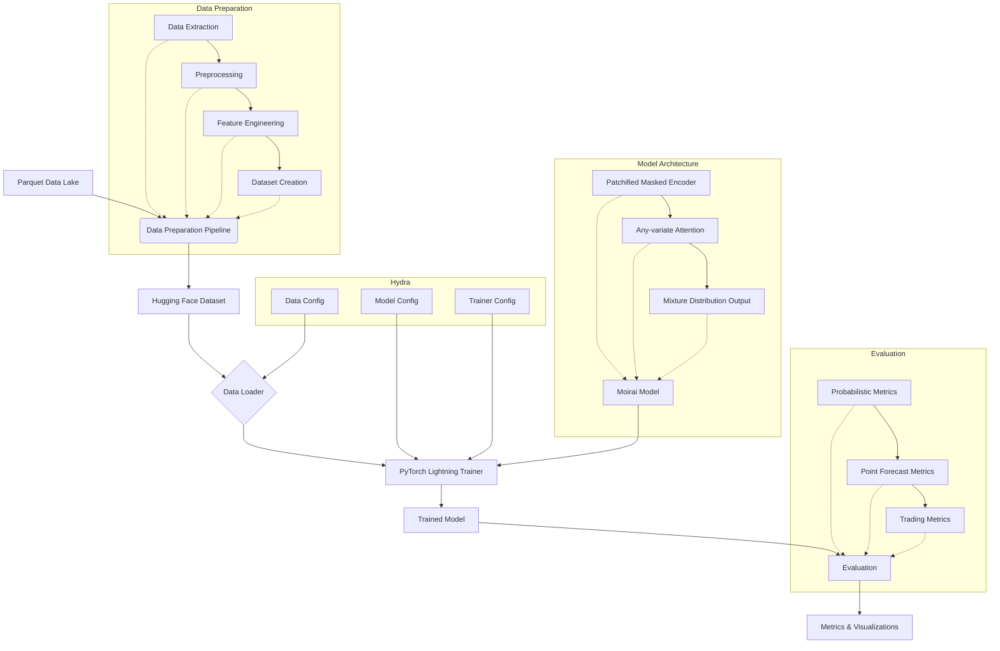

# System Patterns: Uni2TS Fine-Tuning for Multivariate OHLCV Data

## Architecture
The system follows a modular architecture centered around the `uni2ts` library, Hydra for configuration, and PyTorch Lightning for training.

- **Data Layer**: 
  - Financial data is stored in a Parquet data lake with a hive-style partitioning scheme.
  - A comprehensive data preparation pipeline handles extraction, preprocessing, feature engineering, and dataset creation.
  - The pipeline is designed to handle multivariate OHLCV data, with support for technical indicators, cross-asset features, and market regime indicators.

- **Configuration Layer**: 
  - Hydra is used to manage all configurations.
  - The main configuration file (`default.yaml`) composes model, data, and trainer configurations.
  - This allows for flexible and overridable settings, facilitating experimentation with different hyperparameters.

- **Modeling Layer**: 
  - The core model is a pre-trained Moirai transformer from the `uni2ts` library.
  - The model architecture includes a patchified masked encoder, any-variate attention, and mixture distribution output.
  - The model is configured for multivariate time series forecasting, with appropriate patch size, context length, and prediction length.

- **Training Layer**: 
  - PyTorch Lightning handles the training loop, including optimization, checkpointing, and logging.
  - The training process uses the negative log-likelihood (NLL) loss with a mixture distribution output for probabilistic forecasting.
  - Learning rate scheduling with warmup and cosine decay is employed for effective training.

- **Evaluation Layer**:
  - Comprehensive evaluation utilities assess model performance using various metrics.
  - Probabilistic forecasting metrics (CRPS, MSIS) and point forecast metrics (MSE, MAE) are used.
  - Visualization tools create plots of forecasts with confidence intervals.

## Key Technical Decisions

- **Multivariate Data Handling**:
  - The Moirai model's any-variate attention mechanism allows it to handle arbitrary numbers of variates with permutation-equivariance.
  - OHLCV data is structured as a multivariate time series, with 'close' as the target and other components as dynamic covariates.
  - Technical indicators and other features are added as additional variates to enhance the model's forecasting capabilities.

- **Patch Size Selection**:
  - For hourly data, patch sizes of 32 or 64 are used, as recommended in the MOIRAI documentation.
  - The choice of patch size balances temporal detail and computational efficiency.
  - The token budget calculation (`tokens ≈ (#variates) × ⌈(context + horizon) / patch_size⌉`) ensures that the model can handle the desired context and prediction lengths.

- **Context and Prediction Length**:
  - For hourly data, a context length of 168-336 hours (1-2 weeks) and a prediction length of 24-48 hours are used.
  - These values are chosen based on the typical time horizons of interest in financial forecasting.
  - The context length is at least 5x the prediction length for stable forecasting.

- **Probabilistic Forecasting**:
  - The mixture distribution output allows for flexible probabilistic forecasting, capturing different aspects of the data distribution.
  - The negative log-likelihood (NLL) loss is used for training, as it is a proper scoring rule for probabilistic forecasts.
  - Samples from the predicted distribution are used to compute CRPS, MSIS, and other probabilistic metrics.

- **Feature Engineering**:
  - Technical indicators (trend, momentum, volatility, volume) are added to enhance the model's forecasting capabilities.
  - Cross-asset features capture relationships between different assets.
  - Market regime indicators identify different market conditions (trending, ranging, volatile).

- **Normalization and Scaling**:
  - Per-variate scaling is applied to each series independently.
  - Scaling parameters are stored for later denormalization.
  - StandardScaler (z-score) is generally preferred for financial data.

## Component Relationships

## Critical Implementation Paths

### Data Preparation Path
1. **Data Extraction**: Extract OHLCV data from the Parquet data lake using Polars.
2. **Preprocessing**: Handle missing values, outliers, and apply normalization.
3. **Feature Engineering**: Add technical indicators, cross-asset features, and market regime indicators.
4. **Dataset Creation**: Create a Hugging Face dataset with the appropriate schema for uni2ts.

### Model Configuration Path
1. **Patch Size Selection**: Choose appropriate patch sizes based on data frequency.
2. **Context and Prediction Length**: Set context and prediction lengths based on forecasting requirements.
3. **Token Budget Calculation**: Ensure that the total token count stays within the model's limits.
4. **Model Initialization**: Initialize the Moirai model with the appropriate configuration.

### Training Path
1. **Optimizer Setup**: Configure the AdamW optimizer with appropriate learning rate and weight decay.
2. **Learning Rate Schedule**: Set up a learning rate schedule with warmup and cosine decay.
3. **Loss Function**: Configure the negative log-likelihood loss with a mixture distribution output.
4. **Training Loop**: Run the training process using PyTorch Lightning.

### Evaluation Path
1. **Prediction Generation**: Generate probabilistic forecasts using the trained model.
2. **Metric Calculation**: Compute CRPS, MSIS, MSE, MAE, and other metrics.
3. **Visualization**: Create plots of forecasts with confidence intervals.
4. **Performance Analysis**: Analyze the model's performance and identify areas for improvement.
