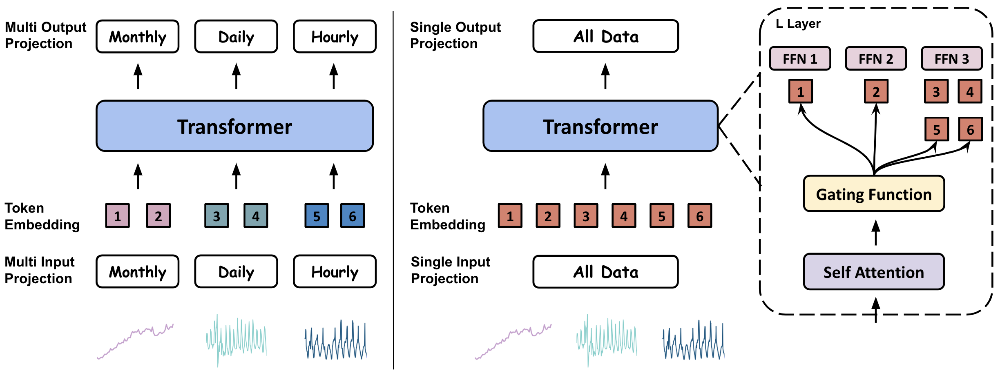
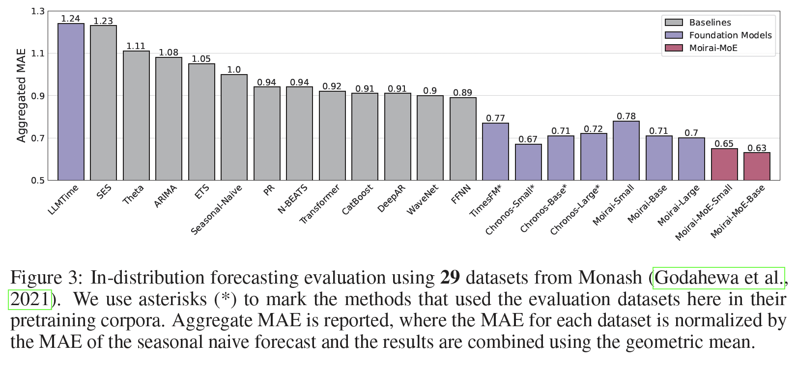
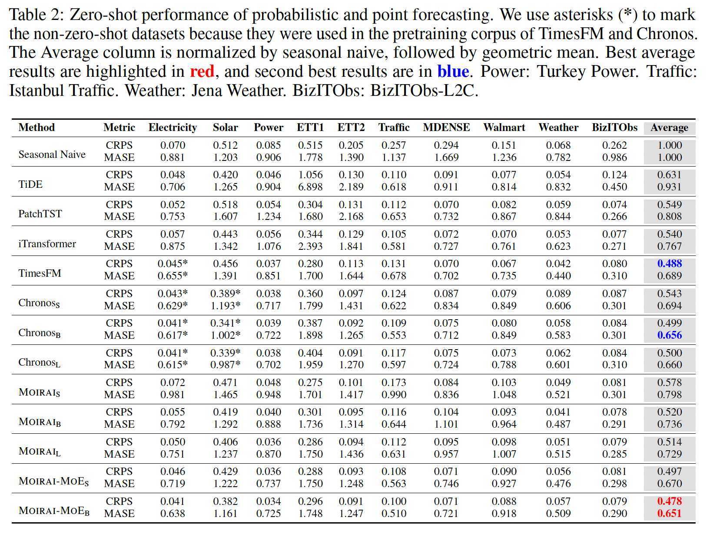

# Moirai-MoE-1.0-R

Our paper [Moirai-MoE: Empowering Time Series Foundation Models with Sparse Mixture of Experts](https://arxiv.org/abs/2410.10469) introduces the first mixture-of-experts time series foundation model.

The figure below presents the major difference between Moirai-MoE and Moirai. Compared to Moirai using multi-heuristic-defined input/output projection layers to model time series with different frequencies, Moirai-MoE utilizes a single input/output projection layer while delegating the task of capturing diverse time series patterns to the sparse mixture of experts Transformers. With these designs, the specialization of Moirai-MoE is achieved in a data-driven manner and operates at the token level.

<p align="center">

</p>


## Models

The pre-trained weights of Moirai-MoE can be found in the following table.

| Model | # Activated Parameters | # Total Parameters |
| :---: | :---: | :---: |
| [Moirai-MoE-1.0-R-Small](https://huggingface.co/Salesforce/moirai-moe-1.0-R-small) | 11m | 117m |
| [Moirai-MoE-1.0-R-Base](https://huggingface.co/Salesforce/moirai-moe-1.0-R-base) | 86m | 935m |


## Usage

Let's see a simple example below on how to use pre-trained Moirai-MoE models to make forecasts. See also the notebooks in the [example folder](https://github.com/SalesforceAIResearch/uni2ts/tree/main/example) to try out Moirai-MoE.

```python
import matplotlib.pyplot as plt
from gluonts.dataset.repository import dataset_recipes

from uni2ts.eval_util.data import get_gluonts_test_dataset
from uni2ts.eval_util.plot import plot_next_multi
from uni2ts.model.moirai_moe import MoiraiMoEForecast, MoiraiMoEModule

SIZE = "small"  # model size: choose from {'small', 'base'}
CTX = 1000  # context length: any positive integer
BSZ = 32  # batch size: any positive integer

# Load dataset
test_data, metadata = get_gluonts_test_dataset(
    "electricity", prediction_length=None, regenerate=False
)
# Uncomment the below line to find other datasets
# print(sorted(dataset_recipes.keys()))

# Prepare model
model = MoiraiMoEForecast(
    module=MoiraiMoEModule.from_pretrained(
        f"Salesforce/moirai-moe-1.0-R-{SIZE}",
    ),
    prediction_length=metadata.prediction_length,
    context_length=CTX,
    patch_size=16,
    num_samples=100,
    target_dim=metadata.target_dim,
    feat_dynamic_real_dim=metadata.feat_dynamic_real_dim,
    past_feat_dynamic_real_dim=metadata.past_feat_dynamic_real_dim,
)

predictor = model.create_predictor(batch_size=BSZ)
forecasts = predictor.predict(test_data.input)

input_it = iter(test_data.input)
label_it = iter(test_data.label)
forecast_it = iter(forecasts)

# Visualize forecasts
fig, axes = plt.subplots(nrows=2, ncols=3, figsize=(25, 10))
plot_next_multi(
    axes,
    input_it,
    label_it,
    forecast_it,
    context_length=200,
    intervals=(0.5, 0.9),
    dim=None,
    name="pred",
    show_label=True,
)
```


## Results

Extensive experiments on 39 datasets demonstrate the superiority of Moirai-MoE over existing foundation models in both in-distribution and zero-shot scenarios.

<p align="center">

</p>

The above figure presents the in-distribution evaluation using a total of 29 datasets from the Monash benchmark. The evaluation results show that Moirai-MoE beats all competitors.

<p align="center">

</p>

The above table shows a zero-shot forecasting evaluation on 10 datasets and Moirai-MoE-Base achieves the best zero-shot performance.

We will soon release scripts to reproduce the results.
